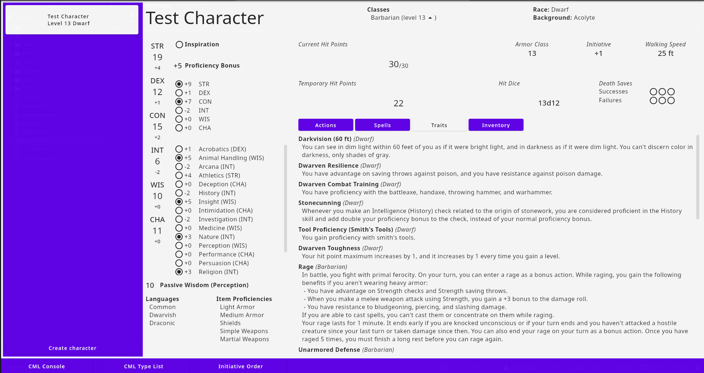
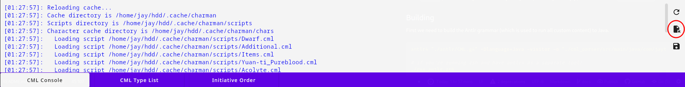

# Charman
*A D&D 5e arbitrary character manager*



## Features
Charman aims to bring you the best possible experience:
 - Easily manage any number of characters, where the program puts everything within a few clicks,
 - Perfect privacy; no data is sent over the network,
 - Endlessly customizable; you can create any possible race, class, background, item, spell and much more, ranging from simple name and description abilities to full-fledged choice-based classes.

## Building & Running
Currently, we do not offer any pre-built binaries (perhaps some time soon?). From here on, we'll assume you have downloaded (or cloned) the source code and are in its root directory.

### Prerequisites
You need to have the following programs installed to build Charman:
 - `java`
 - `gradle`
 - `antlr4` (either as a separate tool on your system, or via Python's pip, where it's called `antlr4-tools`)

### Building
First we need to build the Antlr grammar (which is used to run all custom content) to Java code. 
```sh
antlr4 "./antlr/CML.g4" -Dlanguage=Java -visitor -o "./cml_parser/src/main/java/com/jaytux/cml_parser" -package "com.jaytux.cml_parser"

# if you're running zsh and have antlr4 as a separate tool:
./run_antlr.zsh
```

Now that we have all the required source code, we can run the project using:
```sh
gradle run
```
This will build and run the project. However, the first time you execute it (and after each restart) will take a lot of time. To avoid this, you can build an executable that you can simply run by using:
```sh
gradle createDistributable
```
This will create an executable file under the `build/compose/binaries/main/app/charman/bin` directory.

However, the current version does not ship with pre-built content. Any and all data (races/classes/...) is created by using the same system that is available for users. This means you'll have to install (or load) that content to start out as well.

## Loading Content
*Note: I am probably going to change where in the UI this all is. Additionally, the file browser has a very ugly UI at the moment (see issue #5), again, working on it.*

As Charman doesn't by default come with any races/classes/..., you will have to load them separately. This is the exact same process as for loading other user-created content.

To load content, click the `CML Console` button at the bottom of the screen, then a pane will pop up:

Click the indicated button. This will open a file browser where you can select the files you want to install as scripts into Charman. It will automatically load these files into the runtime as well.

## Creating Custom Content
Charman uses a simple programming language to define all data in its system, CML. There is quite a bit of documentation about CML available in this repository:
 - [CML base documentation](./docs/CML.md)
 - [CML base library](./docs/CML_stdlib.md)
 - [CML D&D 5e-related functions](./docs/CML_5e.md)
 - [CML D&D 5e API to Charman](./docs/CML_Charman.md)

We have implemented (or rather, are implementing) the D&D 5e SRD, which you can use for inspiration, in my [SRDCML repository](https://github.com/jay-tux/SRDCML).

Additionally, since Charman (at the moment) only loads data from its cache, you'll want to locate where this cache is located. A number of factors (OS, configuration, ...) influence this. One of the first lines in the console will tell you where you need to look: `Scripts directory is `. 

All scripts in this directory (and its subdirectories) with the file extension `.cml` are loaded upon startup. To reload the cache while the app is running, you can use the refresh button (the circular arrow) in the CML Console.

All errors and warnings produced by the CML runtime will also be displayed in the CML Console.
